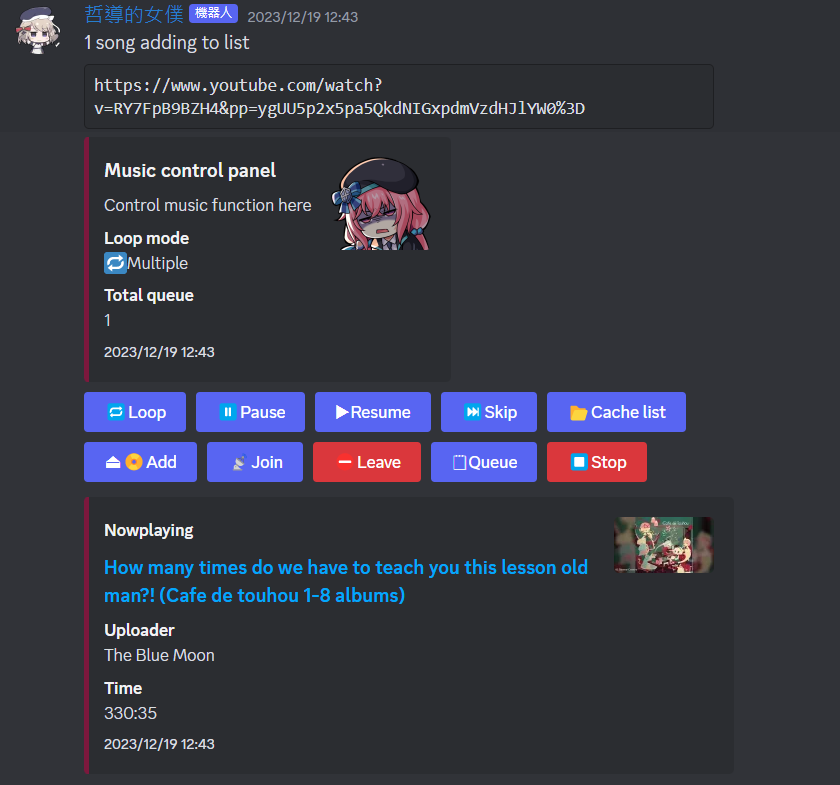
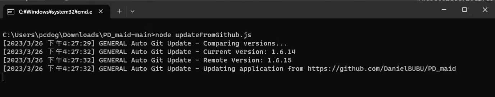
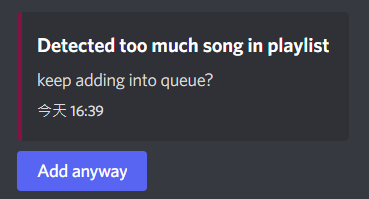
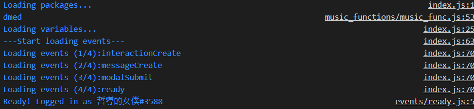
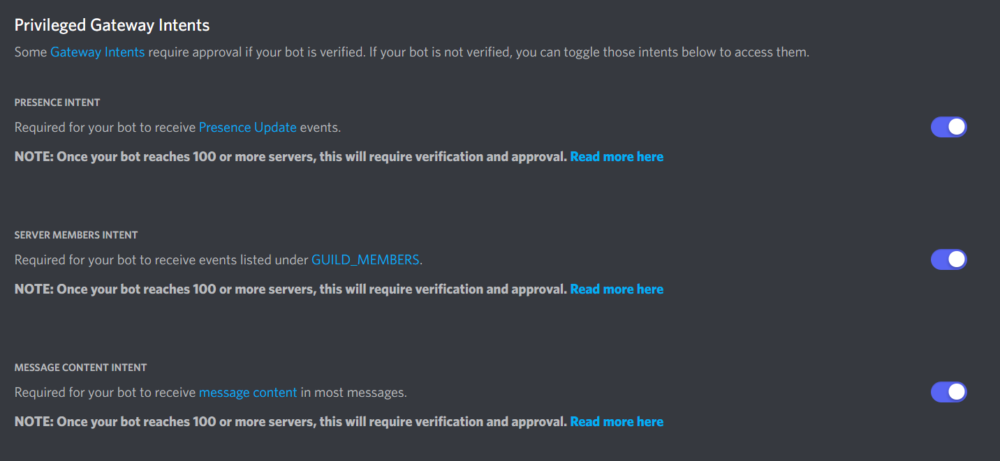
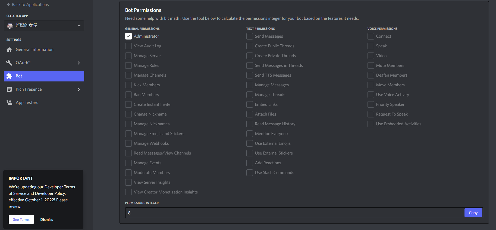
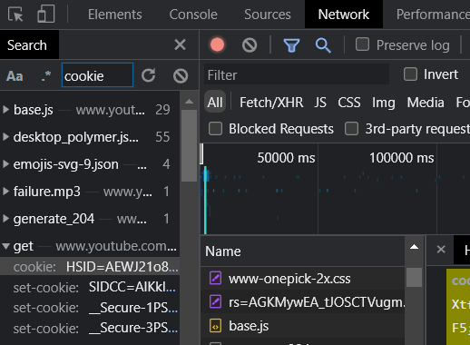
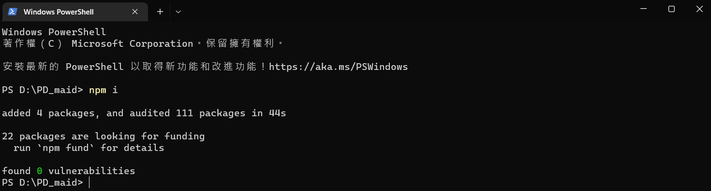

# PD_maid

## Version `1.6.17 Stable` is out!!


- A discord bot with GUI using node.js avaliable on Windows,Linux,and Android</br>
https://github.com/DanielBUBU/PD_maid
- Here are some showcases

- Main GUI

- Auto update

- The GUI when too much songs in the YT playlist

- How console logs looks like when loading


## Why PD_Maid?

- GUI
- Free and easy to build
- Open sauce and readable codes
- Appendable commends
- Self update from github
- RPC functions
- Support mutiple platforms
- Support Youtube,GD,and local file
- Safety access local files and cache list for other users
- Cross server support,bring your music to another server using join and leave buttons
- 3 loop modes
- Information for different links

## How to use

- Step-bystep video tutorial:https://www.youtube.com/watch?v=BbDmGMcapAY
- Installation for Git:https://youtu.be/eGNcXpXxh9U

- create a bot application here(https://discord.com/developers/applications)
or simply follow the instruction here(https://discordjs.guide/preparations/adding-your-bot-to-servers.html#bot-invite-links)</br>

- Remember to change permission integer(use `8` or `4398046511095`) of the invite link and turn on the intents</br>
</br>
</br>

- install ffmpeg(https://www.wikihow.com/Install-FFmpeg-on-Windows) ,Python 3.x,git(https://git-scm.com/download/win) ,and Node.js LTS(https://nodejs.org/en/) on your system and add then into the system path if they don't add automatically(windows)

- create config.json in root</br>
Format example can be found in `config.example.json`</br>
`config.minExample.json` only require bot token string</br>
- (Optional)YT_COOKIE can be found in any YT video with developer mode on</br>
F12->Network->Search`cookie`->find latest one with 3 `set-cookie` below-></br>
double click, copy and paste all stuff like `"YT_COOKIE":"HSID=xxx;SSID=xxx...__Secure-XXXXXXX=xxxx..."`</br>

- install lost packages using `npm i` in cmd</br>

- Click PD_Maid_link_start.bat (or just run using `node .` in cmd),PD_Maid_link_start_admin.bat will ask for admin permission</br>
- Once it's ready, it will output a console log</br>

- config below will create a child process for two guilds,no second child because the array is empty, and the parent will create another child to handle the rest of joined guilds</br>
````
    "guildId": [
        ["421290789868666881","994034761020493888"],
        []
    ]
````
## Support
- Discord:https://discord.gg/bGWZCShbea
## Future

- tag or auto reply picture function
- http server using node.js for web UI

